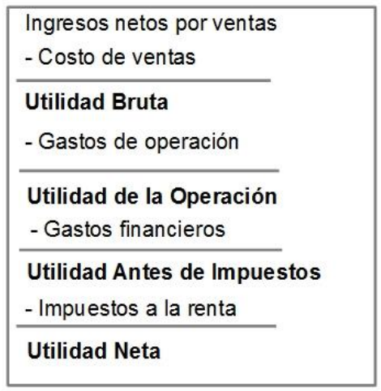
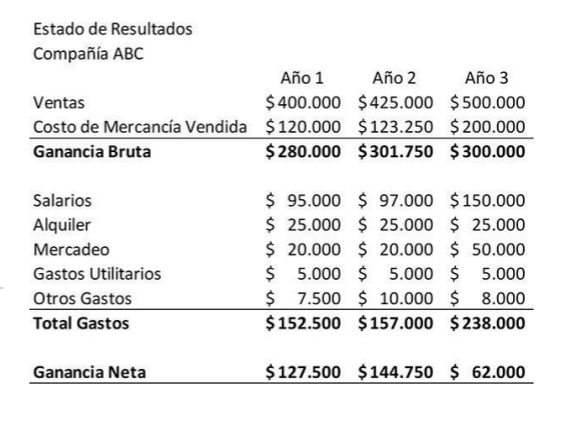
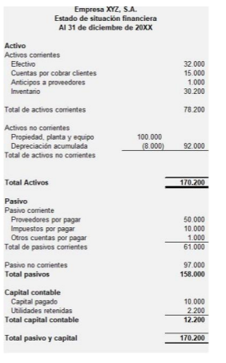

# sesion-02

comenzamos con un repaso de los conceptos vistos la clase anterior

- Sï ha existido una baja en la UF, solo que es muy raro que se lo fuficientemente sostenida ocmo para que quede en negativo alfina del mes

## balance y EERR

dos de los 3 tipos de infrome que uno como gerente de finanzas revisa

### el balance

es una "foto" al último día del mes en la empresa. Plata, activos, pasivos, etc.

### estado de resultado

similar un video, evalúa el mes entero. Se centra en la utilidad final a fin de mes.

recoge actividades relacionadas con la utilidad de la empresa(creación de valor)

enfoca en transacciones relativas a costos y gastos

costos vs gastos

costos: asociados a la producción. Ejemplo bencina de los deliverys, o la plata en materiales.
gastos: cosas q se pagan independientemente si se vende o no. Ejemplo: el sueldo de el secretario.

al comparar costos ingresos y gastos, la diferencia obetenida es la utilidad. Esta se utiliza para evaluar el desempeño de la organización o de cierto periodo o admin.

se hace en orden de arriba pa abajo, y se va restando.

Definición de cada parte por chatgpt:

- **Ingresos netos por ventas**: dinero recibido por ventas, descontando devoluciones, descuentos e impuestos.

- **Costo de ventas**: costo directo de producir o adquirir lo vendido (materias primas, inventario, etc.).

- **Utilidad Bruta**: ganancia tras restar el costo de ventas a los ingresos.

- **Gastos de operación**: costos para funcionar el negocio (sueldos, arriendo, marketing, administración).

- **Utilidad de la Operación**: ganancia después de restar gastos operativos (resultado del negocio principal).

- **Gastos financieros**: costos por deudas o financiamiento (intereses, comisiones bancarias).

- **Utilidad Antes de Impuestos**: ganancia luego de gastos financieros, antes de pagar impuestos.

- **Impuestos a la renta**: tributos sobre las ganancias.

- **Utilidad Neta**: ganancia final después de todos los costos, gastos e impuestos.

- hablando de ganancia bruta:
año 1 gané el 70% de lo que vendí, el año 3 gané el 60% de lo que vendí

- hablando de ganancia neta
el 1er año el gane el 37% de lo que vendí. eE 3er año gané el 12% de lo que vendí.

## contabilidad

se dedica a registrar todos los hitos y actos económicos de una empresa.

En una empresa la financiación puede venir del dueño de la empresa, o de préstamos del banco. 

la contabilidad regstra clasifica y resume sucesos traducibles en infromes, balances, estado de resultado, etc.

## estados financieros

existen 3:

- balance: apunta al capital, patrimonio y bienes. Muestra la posición financiera (activos, pasivos, patrimonio) a una fecha dada.
- EERR: toma ganacias y gastos y dice en cuento quedó. Contempla algo que se devela durante el mes. Ingresos menos gastos
- Flujo de Caja: registar salidad y entradas reales de efectivo

### balance

refleja la situacion economica y financira de una empresa en un momento determinado

Activos = (Pasivos + Patrimonio)

Esto es asi pq lo q yo compro para una empresa sisoi debe ser financiado o por un pasivo(banco) o un activo(CEO de la empresa)

en un balance se separa por categorías

algo interesante dle balance es la deprecicación acumulada. Aunque yo pague 100mil por un compu, ese compu servira por muhcos meses, por lo que no se agregan las 100k altoke, pero a su vez, este va perdiendo valor con el tiempo.

(activos liquidps/psivos liquidos) indicador de liquidez. Depende si el resultado es mayor o menos que 1.

#### activos

es un bien que la empresa posee y puede convertirse en dinero. U otros medios líquidos equivalentes.

escala de liquidez

dependiendo de qué tan rápido es convertible en plata se llma aactivos corrientes o no corrientes

#### pasivos

cosas que tengo que pagar

también tienen una escala segun su exijibilidad

cuetas por pagar, préstamos a corto plazo, IVA, crédito hipotecario de la oficina. 

#### patrimonio

recursos usados para financiar activos, que provienen de los propietarios de la organización, más lo srecurso generados no retirados.

### actividad final

les damos un listado de empresas. 
- Isapre genérica
- agencia de viajes
- banco
- empresa de software
- pesquera
- confitería
- laboratorio de medicamentos
- retail
- estudio de diseño
- productora de eventos

respondadn ciertas preguntas

- comparen:
¿cuál tiene más activos?
¿cuál tiene más pasivos?
¿quien tiene más cuentas por cobrar?
¿quién tiene más cuentas por pagar?
¿en qué tipo de activos no corrientes invierte?
¿cuál tiene los activos más líquidos?
¿cuál es más rentable?
¿cuál tiene más inventario?

esto lo puse es una diapo [aquí](./files/actividad-comparar.pdf)
